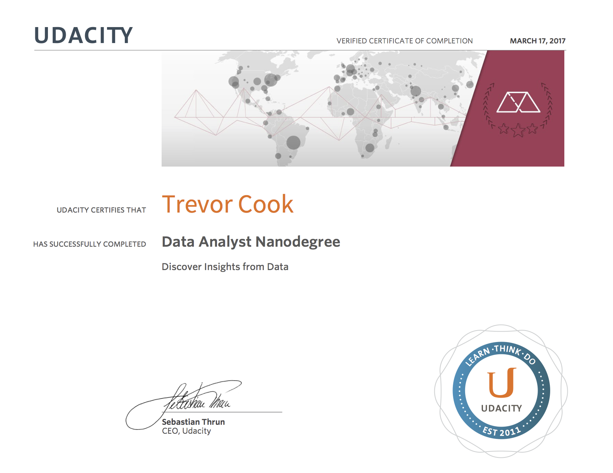

# Udacity-s-Data-Analyst-Nanodegree

### About
This repository contains my project work for Udacity's [Data Analyst Nanodegree](https://www.udacity.com/course/data-analyst-nanodegree--nd002).

P2: Investigate a Dataset 
P3: Wrangle OpenStreetMap Data 
P4: Explore and Summarize Data with R 
P5: Identify Fraud from Enron Email 
P6: Make Effective Data Visualization  
P7: Design an A/B Test

